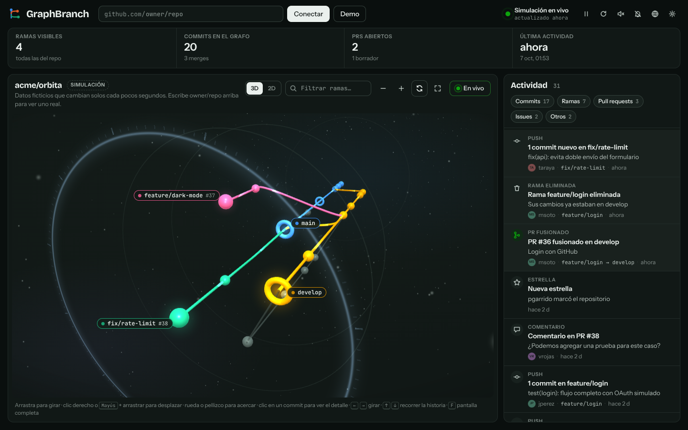

# GraphBranch

Grafo en vivo, en 3D o 2D, de las ramas de un repositorio de GitHub, con alertas de toda su actividad: commits, force-push, ramas creadas y borradas, pull requests, revisiones, issues, releases, estrellas y forks.



- **Vista 3D**: la rama por defecto es el tronco central y las demás se reparten a su alrededor en espiral, las más activas más cerca del tronco; el tiempo avanza hacia ti, hasta el anillo del presente, y la historia se pierde en la niebla. Se mira de tres cuartos, con el pasado a la izquierda y el presente a la derecha, como en la vista 2D. Puedes girar, acercar y desplazarte con el ratón o el teclado; la cámara entra en escena con un vuelo desde el pasado, sigue lo último y, cuando no la tocas, se mece despacio de un lado al otro (sin terminar mirando la historia desde atrás). Pasar el puntero por el nombre de una rama (o llegar a él con el teclado) la **resalta entera**, como en la 2D: lo demás se funde con el fondo, y sigue resaltada mientras su detalle está abierto. **De cerca, cada commit dice su mensaje** a su lado (los más cercanos, sin pisarse), y las fechas del eje del tiempo ya no se pisan entre ellas ni con los nombres de las ramas.
- **Inmersiva**: cada commit nuevo llega volando desde el presente y se posa con una onda y chispas; las cabezas de rama laten con un halo, pulsos de luz recorren las ramas vivas hacia el presente, y polvo y estrellas derivan hacia el pasado.
- **Cada evento con su efecto**: un PR fusionado viaja como un cometa en arco desde su rama hasta la base; un PR abierto levanta un faro de luz sobre su rama; un release lanza fuegos artificiales; una estrella o un fork nuevos cruzan el cielo como estrella fugaz; una rama borrada se deshace en polvo; las aprobaciones, los cambios pedidos y los force-push hacen ondas de color sobre su rama. En la vista 2D pasa lo mismo sobre el plano: el cometa recorre la curva del merge desde la rama del PR hasta la base (o cruza en arco si fue un squash), el faro se levanta sobre la cabeza de la rama, los fuegos artificiales suben desde abajo y la etiqueta de una rama borrada se deshace en polvo. Cada tipo tiene un tope por tanda, así una ráfaga no satura la escena. Con **pantalla completa** (botón o tecla `F`) el grafo ocupa toda la pantalla y los avisos lo acompañan. Si el sistema pide reducir el movimiento, la escena queda quieta.
- **Modo vuelo**: el botón del avión te deja volar libre por el grafo en primera persona, como en una nave, con inercia: `W` `A` `S` `D` para moverte, `Q` `E` para inclinar la nave, `Espacio` `C` para subir y bajar, `Mayús` para acelerar, `X` para el escáner y el ratón para mirar (un clic bloquea el puntero y aparece una mira: el commit o el planeta que está en el centro muestra su detalle y un clic lo fija). La nave gira libre en los tres ejes: inclinada, el ratón mira respecto de ella, y una línea de horizonte junto a la mira muestra cuánto está ladeada. En el valle, al soltar `Q` `E` la nave vuelve sola a nivelarse con el horizonte; en el espacio se queda como la dejaste. La cámara se ladea un poco en las curvas, el campo de visión se abre a toda velocidad y, con el sonido activado, suena un motor que sube con la velocidad. En el celular aparecen un joystick, dos botones para inclinar la nave y uno de radar para escanear, y se mira arrastrando; con un mando de juego, los sticks mueven y miran, los gatillos bajan y suben, `LB` `RB` inclinan, `X` escanea y Start entra o sale del vuelo.
- **Modo galaxias**: el botón de la espiral convierte la vista 3D en un universo, al estilo de *No Man's Sky*. Cada rama es una galaxia: sus commits son las estrellas de un brazo en espiral, con la cabeza en el núcleo (cada push hace girar la galaxia un paso), las bifurcaciones y los merges son puentes de luz entre galaxias y los commits de las ramas ya fusionadas y borradas orbitan, como corrientes de estrellas, la galaxia donde se fusionaron. La rama por defecto está en el centro y las demás alrededor, cada una en su lugar mientras exista. Al acercarte, la galaxia se resuelve en estrellas y aparecen sus **planetas: los archivos**. Entrar en una es una **llegada**, como al salir de un salto en *No Man's Sky*: líneas de velocidad y un destello de su color, el cielo que cambia de golpe a ese color, un rótulo grande con su nombre que se decodifica letra a letra y sus datos (commits, planetas, asteroides, líneas cambiadas, última actividad), una onda de escáner que va revelando los planetas y, con el sonido activado, un acorde. La misma galaxia no se vuelve a anunciar antes de 40 segundos; cuando filma el director de cámara solo aparece el rótulo. Y una vez dentro se ve el **sistema entero**: los **mundos principales** (los ocho planetas más grandes) llevan un marcador en pantalla con su nombre, qué clase de mundo son (gigante gaseoso, mundo oceánico o rocoso) y a qué distancia están, visible desde cualquier punto del sistema; el rótulo de arriba a la izquierda se despliega en un **panel del sistema** con la lista de esos mundos (pasar el puntero por uno lo resalta y muestra su ficha; un clic lleva hasta él), que se abre solo al llegar y se pliega a los segundos (un clic en el rótulo lo abre o lo cierra); la ficha de cada planeta dice qué clase de mundo es y tiene un botón **Visitar**; y al entrar en una galaxia con doble clic o desde la lista de ramas, la cámara se acomoda en un **mirador** desde donde caben todas sus órbitas (si sus archivos llegan después, se reencuadra sola). En la rama por defecto son los del repo; en las demás, los que la rama cambió respecto de la rama por defecto (los nuevos con un halo verde, los borrados apagados y con halo rojo). Los archivos más grandes son planetas, en órbitas con aire entre ellos para pasar volando (cada carpeta ocupa un tramo, con su nombre), y los más chicos, asteroides que dan tumbos en un cinturón; todos giran más lentos cuanto más lejos. Al entrar en el sistema la nave frena para pasar entre los planetas con calma (`Mayús` sigue acelerando) y no puede atravesarlos. Cada planeta tiene su superficie según su archivo (océanos y continentes, bandas de gigante gaseoso o roca con cráteres), el color de su lenguaje, atmósfera, rotación propia y a veces anillos. Un clic en un planeta muestra su ruta, cuántas líneas cambiaron (o su tamaño) y un enlace al archivo en GitHub. El cielo es de nebulosas que se tiñen con el color de la galaxia en la que estás, a toda velocidad las estrellas pasan como estelas y el **escáner** (`X` en vuelo) lanza una onda que hace destellar los planetas que alcanza y revela sus nombres. En vuelo, la **mira fija lo que apunta**: un recuadro de esquinas se cierra sobre el planeta o la galaxia que tienes delante y dice qué es (su clase de mundo, o sus commits) y a qué distancia está. Y para ir lejos está el **hiperimpulsor** (`J` en vuelo, `Y` en el mando, el botón de la flecha en el celular, o **Saltar** en el detalle de una rama): apunta a una galaxia (o marca una como destino), la nave carga unos instantes girando hacia ella, cruza un túnel de luz de su color y sale al mirador de su sistema, con la llegada de siempre; con el sonido activado, la carga sube de tono y el salto suena a golpe de aire. Al rozar un planeta a toda velocidad el borde de la pantalla se enciende, como al entrar en su atmósfera, y con el sonido activado el espacio tiene un zumbido de fondo grave que cambia de nota con la galaxia en la que estás. Un rótulo arriba a la izquierda dice en qué galaxia estás y cuántos archivos tiene. El espacio usa siempre los colores del tema oscuro. La brújula y el minimapa del vuelo llevan a las galaxias, y entrar en una la descubre. Se recuerda en el navegador; al cambiar de modo, cada commit vuela a su lugar nuevo.
- **Mundo abierto**: el grafo no flota en el vacío: recorre el fondo de un valle, con su mapa pintado en el suelo como la sombra de cada rama. A los lados se abre una llanura con lomas y, en el horizonte, una cordillera con curvas de nivel, como en un mapa topográfico; arriba hay cielo con sol (luna y estrellas en el tema oscuro) y nubes que derivan con el viento. El mundo no tiene bordes y el suelo es sólido: la órbita no baja de él y en vuelo se lo puede rozar, no atravesar. En el **modo vuelo** aparece lo de un juego de mundo abierto: una **brújula** arriba con el presente, el pasado y cada rama (la más centrada dice su nombre y a cuántos metros está, y avisa si queda muy arriba o muy abajo), un **minimapa** que gira con la mirada y la altura y la velocidad. Cada rama se **descubre** al pasar cerca: un rótulo grande la anuncia con su motivo musical y el mapa se completa ("Mapa explorado: 3/12"); en la brújula y el minimapa las que faltan van huecas, y descubrirlas todas desbloquea el logro *Cartógrafo*. Para ir a una rama, **Marcar como destino** (en su detalle, o un clic en su marca de la brújula): una columna de luz la señala desde lejos, la brújula y el minimapa guían hasta ella y al llegar suena un aviso. Lo descubierto se recuerda por repositorio, solo en el navegador.
- **Recorrer la rama**: en el detalle de un commit o de una rama, **Recorrer la rama** lleva la cámara como una montaña rusa por toda la rama, desde el commit del que nace hasta su cabeza. Doble clic en un commit vuela hasta él.
- **Director de cámara**: el botón de la cámara de cine deja que la cámara se dirija sola, como en una transmisión. Elige qué mirar según el interés de lo que acaba de pasar (un release pesa más que un PR fusionado, que pesa más que un PR abierto, que pesa más que un commit), encuadra el arco entero de un merge o los fuegos de un release, sostiene cada plano unos segundos sin volver a la misma rama antes de 30 s (salvo por algo grande) y, cada tres planos de detalle, abre un plano general. Un rótulo abajo a la izquierda dice qué se está viendo. Los saltos largos son un corte con fundido y no un vuelo, para no marear; mientras dura un plano la cámara gira o se acerca despacio. Cuando no pasa nada rueda planos tranquilos: el presente, la vista general o un paseo por una rama. Basta mover la vista para tomar el control: el director lo cede al instante (el botón lo marca con un punto) y lo retoma tras unos segundos sin tocar nada. Con movimiento reducido solo hay cortes.
- **Modo TV**: el botón de la pantalla (o abrir la página con `?tv=1`, por ejemplo `index.html?repo=owner/repo&tv=1`) la convierte en un panel para una pantalla compartida: solo quedan el grafo 3D con el director de cámara, el resumen, el panel de actividad y un reloj, todo con letra que crece con la pantalla, y la pantalla no se apaga (Screen Wake Lock, donde el navegador lo permite). El sonido arranca apagado, porque en un espacio compartido llega a todos, y la capa de juego no hace fiestas. Una barra arriba a la derecha (se esconde con el puntero tras unos segundos quieto) tiene **Pausar** (también la barra espaciadora: detiene las novedades, la cámara y la animación de fondo), sonido, pantalla completa (`F`) y **Salir del modo TV** (también `Esc`). Si pasan unos minutos sin novedades, reproduce la historia con el Replay y vuelve sola al presente; cualquier actividad nueva la interrumpe. Con varios repos seguidos (`index.html?repo=owner/api&repo=owner/web&tv=1`) se ven sus pestañas, y la pantalla pasa sola al repo donde llega algo nuevo si el que muestra lleva 45 segundos sin novedades.
- **Replay**: el botón de la flecha circular reproduce la historia del repo como un time-lapse, al estilo de Gource: los commits llegan en orden, las ramas nacen, crecen y se fusionan (las ya borradas reaparecen mientras existieron, con el nombre que dejó su merge), una fecha grande marca el tiempo y unos rótulos cuentan los hitos (ramas nuevas, PRs fusionados, releases), con sus efectos y su sonido. Los periodos sin actividad se comprimen, así que toda la historia dura menos de un minuto; la línea de tiempo marca los merges y las releases, se puede arrastrar, pausar (también con la barra espaciadora) y acelerar hasta 4×. Usa lo que ya está cargado, sin consultas extra: para una historia más larga, sube los **Commits por rama** en Ajustes. Mientras tanto lo nuevo sigue llegando al panel de actividad, y **Volver al presente** lo muestra.
- **Logros, nivel y misión del día**: el repo sube de nivel con lo que el equipo consigue (merges, revisiones aprobadas, releases, issues cerrados, ramas fusionadas que se limpian; un commit suma poco), cumple una misión distinta cada día ("Fusionar 3 pull requests", "Cerrar 2 issues"…) y desbloquea 15 logros, como *Primer merge*, *Día de merges*, *¡A producción!*, *Bandeja vacía*, *Día récord*, *Bosque*, *Viajero del tiempo* o *Cartógrafo*. Cada logro, nivel o misión se celebra con un aviso dorado, fuegos artificiales y fanfarria, y cuando el equipo encadena varias cosas seguidas aparece un **combo**. El trofeo de la barra superior abre la vitrina, con el criterio de cada logro y un interruptor para apagar todo. Celebra al repo y al equipo, nunca a personas: no hay rankings, rachas personales ni contadores por autor, porque empujan a trabajar de más (GitHub quitó sus rachas en 2016 por eso). Se guarda solo en el navegador, por repositorio.
- **Vista 2D tipo metro**: cada rama es un carril; los commits avanzan a la derecha. La rama por defecto va arriba, debajo las fijadas y luego las demás, de la más reciente a la menos activa. Cambia entre 3D y 2D con el selector del grafo. Abajo, un **minimapa** muestra el grafo entero en miniatura con la ventana de lo que se ve: un clic lleva hasta ese punto y la ventana se arrastra (en el Replay lo reemplaza su propia línea de tiempo). Las ramas ya fusionadas y borradas llevan su **nombre** sobre su tramo gris (sale del mensaje de su merge) y pasar el puntero por un commit resalta toda su rama. Se recorre también con el **teclado**: flechas, `Re Pág` `Av Pág`, `Inicio` `Fin` y `+` `-`.
- **Colores**: toda rama viva tiene un color propio, de una paleta de más de 8.000: los 8 primeros están elegidos a mano y el resto se genera repartido lo más lejos posible entre sí, en el tema claro y en el oscuro, así que cada rama nueva toma un color distinto sin importar cuántas haya. La rama por defecto lleva siempre el primero, cada una conserva el suyo mientras exista y la que se borra lo deja libre. El gris es solo de las ramas muertas: las ya fusionadas y borradas, y las ya fusionadas que siguen existiendo (su cabeza ya está en la rama por defecto). Las ramas de larga vida (`develop`, `release/…`, protegidas) y las recién creadas sobre la cabeza de la rama por defecto no se dan por muertas; una rama fusionada que recibe commits nuevos vuelve a tener color.
- En ambas, las bifurcaciones y merges se dibujan como curvas y las ramas muertas quedan en gris.
- **En vivo**: los commits nuevos aparecen con una onda, la etiqueta de la rama se desliza hasta su nueva cabeza, la rama sube justo bajo la rama por defecto (los carriles se reordenan según su última actividad) y la vista sigue lo último (o te deja recorrer la historia).
- **Guardar imagen**: el botón de la cámara de fotos guarda la vista como un PNG tal como se ve en ese momento, en 3D o en 2D, en cualquier modo (galaxias, vuelo, Replay), con las etiquetas de las ramas y los efectos en curso, y abajo una franja con el repo y la fecha, lista para compartir. La 2D sale al doble de resolución; la 3D, a la resolución con que se dibuja. Se descarga como cualquier archivo (`graphbranch-owner-repo-2026-10-10-1430.png`); en la app de escritorio va directo a la carpeta de descargas.
- **Alertas**: panel de actividad filtrable, avisos emergentes, sonido opcional, notificaciones del sistema cuando la pestaña está en segundo plano y contador en el título de la pestaña.
- **Varios repos a la vez**: cada repo que conectas se suma a los que ya sigues, en una pestaña bajo la barra superior. Todos se siguen en vivo aunque no estén a la vista: sus novedades llegan al panel de actividad (que junta las de todos y dice de qué repo es cada una), a los avisos, al sonido y a las notificaciones, y cada pestaña muestra su estado y cuántas novedades llegaron sin verla. Un clic en la pestaña, o en una actividad de ese repo, lo muestra al momento, sin volver a cargarlo; la **×** deja de seguirlo. Se recuerdan entre visitas, y la URL los lleva todos (`?repo=owner/api&repo=owner/web`), así se comparte el conjunto. Hasta 10 repos.
- **Sonido**: cada tipo de evento tiene su timbre (pulsación para los commits, campana para los PRs, acorde para los merges, arpegio para los releases) y todo suena en una escala pentatónica, a un pulso tranquilo: varios eventos juntos forman una frase. La rama por defecto es la tónica y cada rama tiene su nota; en 3D el sonido sale del lado de la pantalla donde está la rama. Viene apagado; se activa con el altavoz de la barra superior.
- **Estado en cada rama**: número de PR abierto, directamente en la etiqueta.
- **Todas las ramas**: se ven todas las ramas del repo, sin tope, también con miles: aparecen de a poco, las más activas primero, y el grafo sigue fluido (ver más abajo).

- **Instalable y sin conexión**: la versión web se instala como una app más, en el celular o en el escritorio, sin Electron: con su ícono, en su propia ventana y sin la barra del navegador (en Chrome y Edge, el botón de instalar de la barra de direcciones; en el iPhone, **Compartir → Agregar a inicio**). Después de la primera visita abre aunque no haya red: la demo funciona entera y los repos de GitHub dicen que esperan la conexión, y siguen solos en cuanto vuelve. Con red siempre carga la última versión.
- **Todos los idiomas**: la interfaz está traducida a 40 idiomas (incluidos árabe, hebreo, persa y urdu, de derecha a izquierda), se elige sola según el navegador y se puede cambiar en vivo desde el globo de la barra superior. Fechas, números y "hace 5 min" salen de `Intl`, así que también se ven bien en idiomas sin traducción (ver [Idiomas](#idiomas)).

No necesita servidor ni compilación: es HTML, CSS y JavaScript que llama directo a `api.github.com` desde tu navegador. Las librerías (d3 y Three.js) y las fuentes van incluidas en `vendor/`, así que solo sale a internet para hablar con GitHub. La vista 3D usa WebGL; si el navegador no lo tiene, la app abre la 2D. También corre como [aplicación de escritorio](#aplicación-de-escritorio) con Electron.

## Uso

1. Abre `index.html` (doble clic sirve), publícalo con GitHub Pages (y desde ahí, instálalo) o usa la [aplicación de escritorio](#aplicación-de-escritorio) (abajo).
2. Escribe `owner/repo` o pega la URL del repositorio y pulsa **Conectar**. Sin repositorio arranca una **demo** simulada. Para seguir otro repo a la vez, conéctalo igual: se suma en una pestaña y el anterior sigue en vivo detrás (ver [Varios repos a la vez](#varios-repos-a-la-vez)).
3. Opcional pero recomendado: en **Ajustes** (engranaje) agrega un token de GitHub.

También puedes abrir un repo directo con `index.html?repo=owner/repo`, varios con `index.html?repo=owner/api&repo=owner/web` (el primero queda a la vista) y en modo TV con `index.html?repo=owner/repo&tv=1`.

### Token

Sin token GitHub permite 60 consultas por hora, así que la vista se actualiza cada pocos minutos y las ramas llegan de a poco. Con un token se actualiza cada 10 segundos, ves repos privados y todas las ramas cargan en segundos, aunque sean miles. La cuota es una sola para todos los repos que sigues: sin token, seguir varios los vuelve más lentos todavía, así que con más de uno conviene el token.

Crea un token *fine-grained* de solo lectura en <https://github.com/settings/personal-access-tokens/new> con acceso al repositorio y estos permisos (todos *Read-only*): **Metadata** (incluye la actividad del repo: pushes y ramas creadas o borradas), **Contents** y **Pull requests**.

El token se guarda solo en el `localStorage` de tu navegador (en la app de escritorio, cifrado con el llavero del sistema) y se envía únicamente a `api.github.com`.

### Ciclo de actualización

GraphBranch consulta GitHub en ciclos: cada 10 segundos con token y cada minuto sin él, o más espaciado si la cuota no alcanza hasta su próximo reinicio (el indicador dice **En vivo, más lento**; con token cuida la cuota de GraphQL y también la de REST). El indicador de la barra superior cuenta qué pasa: "actualizando…" mientras dura un ciclo y "próxima en 10 s" entre uno y otro. El ciclo se cuida solo:

- Si una consulta no llega entera en 30 segundos se corta y se reintenta, así una conexión colgada no deja la vista congelada.
- Tras un error los reintentos se espacian (5 s, 10 s, 20 s… hasta 5 minutos, con algo de azar para que muchas pantallas no reintenten a la vez). Si GitHub pide esperar (cuota agotada, o límite secundario: lo que diga `Retry-After`, o un minuto si no lo dice), espera justo eso y no lo cuenta como fallo.
- Sin red no insiste: espera a que el navegador avise que volvió la conexión ("esperando la conexión") y consulta enseguida.
- Al volver a la pestaña, o cuando el navegador la descongela, si ya tocaba consultar lo hace al momento (en segundo plano los navegadores frenan los temporizadores; igual sigue consultando, para poder avisar).
- **Actualizar ahora**, cambiar el filtro o fijar una rama adelantan el ciclo del repo a la vista (si hay uno en curso, el siguiente va enseguida); **Pausar** detiene los de todos los repos seguidos, y al dejar de seguir uno se cortan sus consultas en curso.
- Con varios repos seguidos, cada uno tiene su ciclo y cuenta con que los demás gastan lo mismo que él: así entre todos no agotan la cuota (cuantos más repos, más espaciado, si la cuota no da para todos cada 10 segundos). Al abrir la página arrancan escalonados, no todos en el mismo instante.

## Varios repos a la vez

Cada repo que conectas se suma a los que ya sigues. Con más de uno aparece una fila de pestañas bajo la barra superior:

- **Todos en vivo**: cada repo tiene su propia conexión con GitHub y sigue consultando aunque no esté a la vista. Lo que pasa en cualquiera llega al panel de actividad, a los avisos emergentes, al sonido y a las notificaciones del sistema, con el nombre del repo.
- **Pestañas**: cada una muestra el estado de su repo (el mismo punto de color del indicador de la barra: en vivo, más lento, sin conexión, cargando) y cuántas novedades llegaron mientras no estaba a la vista. Un clic la muestra al momento: el repo ya está cargado, así que no se vuelve a pedir a GitHub. La **×** deja de seguirlo (y se lleva su actividad del panel).
- **Panel de actividad**: junta la actividad de todos los repos, la más reciente primero (hasta 300 elementos por repo). Un clic en una actividad de otro repo lo muestra y va hasta esa rama o commit.
- **Lo que es de cada repo**: el grafo, el resumen, el Replay, las ramas fijadas, el filtro, las ramas descubiertas en el modo vuelo y los logros. Los logros de los repos que no están a la vista suman igual, sin festejo; la vitrina muestra los del repo a la vista.
- **Conectar** un repo que ya sigues lo muestra (y, si quedó sin conexión, lo vuelve a intentar). **Demo** muestra la demo sin dejar de seguir tus repos; la demo se cierra al volver a uno de ellos.
- **Se recuerdan**: al volver a abrir la página siguen los mismos repos y se muestra el último que mirabas. La URL los lleva todos (`?repo=owner/api&repo=owner/web`, el primero a la vista), así que se puede compartir o dejar abierta en una pantalla; los repos de una URL se suman a los que ya seguías.
- **La cuota se reparte**: los ciclos de cada repo se espacian para que entre todos no agoten la cuota de GitHub (ver [Ciclo de actualización](#ciclo-de-actualización)). Sin token la cuota es de 60 consultas por hora para todos juntos, así que para seguir varios conviene un token.
- Se pueden seguir hasta 10 repos a la vez.

## Repositorios con miles de ramas

GraphBranch muestra todas las ramas, pero no las vuelve a pedir todas en cada ciclo (con 10.000 ramas serían 100 consultas cada vez). Según lo que tenga disponible, usa uno de tres modos:

| Modo | Cuándo | Cómo detecta el movimiento |
|---|---|---|
| **GraphQL** | Con token | Lista todas las ramas de a 100 por consulta: en cada ciclo si caben en una, y si no al cargar y cada unos minutos (más espaciado cuantas más páginas). Entre medio, la API de actividad del repo dice qué ramas recibieron pushes, se crearon o se borraron, casi al instante (una consulta con ETag: si no hubo cambios no gasta cuota), y solo esas se consultan, junto con los PRs abiertos y las ramas fijadas, en una consulta GraphQL por ciclo. Cuesta ~1 punto de los 5.000/hora. Si el token no puede leer la actividad, usa el feed de eventos, que llega con unos minutos de retraso, y mira en cada ciclo las 50 ramas más activas. |
| **Lista** | Sin token y hasta 100 ramas | Lista las ramas por REST con ETag y compara. La historia de cada rama cuesta una consulta, así que llegan de a 12 por ciclo, cuidando la cuota. |
| **Eventos** | Sin token y más de 100 ramas | Sigue el feed de eventos del repo (pushes, ramas creadas y borradas). GitHub lo entrega con algunos minutos de retraso, y sin token solo se ven las ramas que aparecen en él: para verlas todas hace falta un token. |

En un repo grande las ramas aparecen de a poco: el primer dibujo llega en un par de segundos con la rama por defecto, las fijadas y las de actividad más reciente, y el resto se suma en los ciclos siguientes, por orden de actividad (el resumen dice "cargando el resto" mientras tanto). Esas ramas entran sin avisos ni efectos de llegada, que quedan para lo que pasa en vivo. Cada rama pide solo su historia: unos pocos commits y, si con eso no llega a lo ya cargado, el resto desde donde quedó, así que cargar 5.000 ramas costó unos 700 puntos de GraphQL en nuestras pruebas, una sola vez.

Para concentrarte en lo que te importa:

- **Fijar ramas**: clic en una rama del grafo → **Fijar**. Las ramas fijadas van justo debajo de la rama por defecto (en 3D, las primeras de la espiral) y se muestran aunque no pasen el filtro. Se recuerdan por repositorio.
- **Filtrar ramas**: el campo del grafo filtra por nombre, por ejemplo `release/` o `equipo-pagos/`. En modo GraphQL el filtro se aplica en GitHub, así que con miles de ramas solo se listan y cargan las que coinciden.

Las vistas aguantan miles de ramas:

- **Galaxias**: cada galaxia, vista de lejos, es un solo cuadro dibujado en el sombreador, todas en una llamada de dibujo; solo las cinco más cercanas se resuelven en estrellas sueltas y solo la galaxia en la que estás muestra sus planetas y asteroides (hasta 360 archivos, 120 de ellos planetas: con más, los más cerca de la raíz). Los archivos se piden recién al acercarse, con una consulta por rama, y se recuerdan mientras la rama no se mueva.
- **3D**: los commits y todas las aristas, también las curvas de bifurcación y merge, se dibujan con instancias (unas pocas llamadas de dibujo aunque haya miles de ramas), y las líneas punteadas van todas en un solo objeto. A la GPU sube solo la parte usada de cada lote, lo perdido en la niebla no se dibuja y con decenas de miles de commits las esferas y los tubos se simplifican. El mundo no suma objetos por rama: el terreno es una sola malla que acompaña a la cámara (su relieve lo calcula la GPU) y crece con la espiral, el mapa del suelo va en el mismo lote que las aristas, y la brújula y el minimapa del vuelo muestran solo las ramas más cercanas. Las etiquetas se crean al mostrarse: con muchas ramas solo se ven las más cercanas que no se pisan (hasta 160 a la vez), y los mensajes de los commits cercanos reusan siempre los mismos 14 elementos. Resaltar una rama solo reescribe los colores de los lotes mientras dura el fundido. En reposo solo se animan los efectos a ~30 fps, no dibuja nada mientras el grafo está fuera de pantalla y, si el equipo no da abasto, baja la resolución sola.
- **2D**: cada commit, arista, etiqueta y fila de la leyenda crea su elemento recién cuando entra en pantalla, y los eventos se escuchan una vez por grupo. Con 2.000 ramas y 8.000 commits el SVG tiene solo unas decenas de commits dibujados. El minimapa es un canvas que se pinta de nuevo solo cuando cambian los datos (una llamada de dibujo por color; durante el Replay espera) y en cada movimiento solo copia esa imagen y marca la ventana. Los efectos van en otro canvas, que dibuja solo mientras hay alguno y sin volver a recorrer los commits en cada cuadro.
- **Layout**: sin pasos cuadráticos, sigue rápido con miles de ramas (también en el Replay, que lo recalcula a cada momento).

Las alertas siguen la misma lógica: una rama nueva o que recibe un push aparece en el grafo con su alerta en el siguiente ciclo, y una borrada sale con la suya.

## Controles

En 3D:

- Arrastrar: girar alrededor. Clic derecho o `Mayús` + arrastrar: desplazarse. Rueda o pellizco: acercar.
- Teclado (después de hacer clic en el grafo): `←` `→` girar, `↑` `↓` viajar por la historia, `+` `-` acercar o alejar. Se mantienen pulsadas.
- Doble clic en un commit: volar hasta él (de cerca se leen los mensajes de los commits).
- Modo vuelo (avión): `W` `A` `S` `D` moverse, `Q` `E` inclinar la nave, `Espacio` `C` subir y bajar, `Mayús` acelerar, `X` escáner, `J` hiperimpulsor (en el modo galaxias: salta a la galaxia que apunta la mira o a la marcada como destino), ratón para mirar, `Esc` para salir. En el celular, joystick, botones para inclinar, escanear y saltar, y arrastrar para mirar; también funciona con mando de juego (`X` escanea, `Y` salta, Start entra o sale del vuelo).
- Modo galaxias (espiral): cada rama es una galaxia; acércate (con la rueda, con doble clic o volando) para ver sus archivos como planetas. Doble clic en una galaxia: entrar y ver su sistema entero. El rótulo de arriba a la izquierda se despliega con sus mundos principales: clic en uno para ir hasta él. Clic en un planeta o en su nombre: detalle del archivo (con el botón Visitar). Doble clic en un planeta: acercarse.
- Destino: **Marcar como destino** en el detalle de un commit o de una rama, o un clic en la marca de una rama en la brújula del vuelo (otro clic lo quita).
- Pasar el puntero por un commit lo resalta; por el nombre de una rama (o llegar a él con `Tab`), resalta la rama entera y apaga lo demás.
- Botón de giro: activa o pausa el giro lento automático (en el valle, un vaivén de un lado al otro; en el modo galaxias, vueltas enteras).
- Director de cámara (cámara de cine): la cámara se dirige sola; arrastrar, la rueda, las flechas o un clic le quitan el mando hasta que dejas de tocar.

En 2D:

- Arrastrar: moverse por la historia y entre carriles.
- Rueda: recorrer la historia; sobre la leyenda de la izquierda, recorrer los carriles. `Ctrl` + rueda o pellizco: zoom del eje de tiempo.
- Teclado (después de hacer clic en el grafo): `←` `→` recorrer la historia, `↑` `↓` cambiar de carril (con `Mayús`, pasos más largos), `Re Pág` `Av Pág` una pantalla de carriles, `Inicio` el principio de la historia, `Fin` lo último (y vuelve a seguirlo), `+` `-` zoom.
- Minimapa (abajo): clic para ir a ese punto, arrastrar la ventana para moverse, rueda para recorrer la historia.
- Pasar el puntero por un commit o por el nombre de una rama resalta la rama.

En las dos:

- Clic en un commit o en el nombre de una rama: detalle con autor, mensaje, PR y enlace a GitHub.
- Clic en un nombre de la leyenda o en un elemento del panel de actividad: lleva a esa rama o commit.
- **En vivo** / **Ir a lo último**: sigue (o vuelve a seguir) los commits nuevos.
- **Pantalla completa** (botón o `F`): el grafo ocupa toda la pantalla; `Esc` o `F` para salir.
- **Trofeos** (barra superior, o la franja de nivel y misión bajo el título del grafo): abre la vitrina de logros; ahí se apaga o enciende la capa de juego.
- **Replay** (flecha circular): reproduce la historia; barra espaciadora para pausar, arrastra la línea de tiempo para saltar y **Volver al presente** para salir.
- **Guardar imagen** (cámara de fotos): descarga la vista como PNG.
- **Modo TV** (pantalla): barra espaciadora para pausar todo, `F` para pantalla completa y `Esc` o **Salir del modo TV** (en la barra de arriba a la derecha) para salir.
- **Pausar** (barra superior): deja de traer novedades y detiene todo lo que se mueve solo (giro, director, fondo).
- Los chips del panel de actividad filtran la lista y también los avisos emergentes.
- **Pestañas de repos** (con más de uno seguido): clic para mostrar ese repo, **×** para dejar de seguirlo.

## Idiomas

GraphBranch elige el idioma en este orden: `?lang=` en la URL (para esa visita), el que escogiste con el globo de la barra superior (se recuerda) y el del navegador. Si no hay traducción para ese idioma, usa inglés; los textos que falten en un idioma también caen en inglés.

- **Traducidos**: inglés, español, chino (simplificado y tradicional), hindi, árabe, portugués, bengalí, ruso, japonés, francés, alemán, coreano, italiano, turco, vietnamita, indonesio, malayo, filipino, tailandés, persa, urdu, hebreo, tamil, suajili, neerlandés, polaco, ucraniano, checo, eslovaco, húngaro, rumano, búlgaro, croata, griego, sueco, danés, noruego (bokmål), finés y catalán.
- **Sin traducción**: fechas, horas, números, "hace 5 min", "hoy" y "ayer" siguen el idioma del navegador porque salen de `Intl`; el resto se muestra en inglés.
- **Derecha a izquierda**: con árabe, hebreo, persa o urdu la interfaz se espeja. El grafo no: el tiempo siempre avanza igual.
- **Contenido de GitHub**: nombres de ramas, mensajes de commit y títulos de PR se muestran tal cual vienen, en cualquier alfabeto. La demo inventa sus mensajes en español e inglés (en los demás idiomas usa inglés).
- Las traducciones se hicieron con ayuda de IA y no las ha revisado una persona de cada idioma: las correcciones son bienvenidas.

### Agregar o corregir un idioma

1. Copia `js/locales/en.js` a `js/locales/<código>.js` (código BCP 47: `fr`, `pt`, `zh-Hant`…), cambia el código en `GB.i18n.define('<código>', …)` y traduce los valores. Las claves, los `{parámetros}` y las etiquetas HTML (`<kbd>`, `<em>`…) no se tocan.
2. Los textos con número (`{ one: …, other: … }`) llevan una forma por categoría plural del idioma; para saber cuáles: `node tools/check-i18n.mjs --plurals <código>`.
3. Súmalo a `LOCALES` en `js/i18n.js` con su nombre en el propio idioma (y `rtl: true` si se escribe de derecha a izquierda).
4. Comprueba: `node tools/check-i18n.mjs <código>` avisa de claves que faltan o sobran, parámetros o etiquetas cambiados y formas plurales incompletas, y `node tools/smoke.mjs --langs` abre la app en cada idioma en pantalla de celular y avisa si algo desborda.

Opcional: si quieres que la demo hable tu idioma, agrega un bloque en `js/sources/demo-content.js`.

## Publicar en GitHub Pages

El flujo `.github/workflows/pages.yml` publica el sitio en cada push a `master`. Solo hay que activarlo una vez: **Settings → Pages → Build and deployment → Source: GitHub Actions**.

Publicada así, la página se puede instalar y abre sin red: `manifest.webmanifest` la describe como app (nombre, colores e íconos de `icons/`, que salen de `electron/icon.png`) y `sw.js`, un service worker, guarda la página, `css/`, `js/`, `vendor/` y los íconos. Con red, cada archivo se pide a la red como siempre y la copia guardada se pone al día, así que publicar una versión nueva no exige nada más. Si agregas, borras o renombras un archivo en esas carpetas, actualiza la lista `FILES` de `sw.js`: `node --test` avisa si no coincide.

## Aplicación de escritorio

La misma página corre como aplicación de escritorio con [Electron](https://www.electronjs.org/), en Windows, macOS y Linux. Hace falta Node.js 22.12 o superior.

```
npm install
npm start                               # la demo o los repositorios que seguías
npm start -- --repo=owner/repo --tv     # un repo directo y en modo TV (también --lang=es)
npm start -- --repo=owner/api --repo=owner/web   # varios repos a la vez
npm run dist                            # el instalador para este sistema, en dist/
npm run test:e2e                        # las pruebas de punta a punta (ver Pruebas)
```

- Es la misma app: `electron/main.js` solo abre `index.html` en una ventana, así que lo que cambies en `js/` o `css/` vale para las dos versiones (en la de escritorio se recarga con `Ctrl+R` o `Cmd+R`).
- La página se sirve desde `app://graphbranch/`, un origen propio en vez de `file://`: el CSP funciona igual que en la web, y los ajustes quedan en los datos de la app, aparte de los del navegador.
- El token no va a `localStorage`: se guarda cifrado con el llavero del sistema (Llavero en macOS, DPAPI en Windows, el llavero de GNOME o KWallet en Linux), en un archivo de los datos de la app. La primera vez, macOS puede pedir permiso para usar el llavero. En Linux sin llavero (escritorios que Chromium no reconoce, como i3 o Sway) se guarda sin cifrar y **Ajustes** lo avisa; si tienes uno, abre la app con `--password-store=gnome-libsecret` (o `kwallet6`).
- Los enlaces a GitHub se abren en el navegador del sistema. La ventana no puede navegar a otro sitio ni usar Node, y solo tiene los permisos que la app usa: notificaciones, pantalla completa, captura del puntero (modo vuelo) y pantalla siempre encendida (modo TV).
- Cerrar la ventana no cierra la app: queda en la bandeja del sistema (en macOS, en la barra de menús) y sigue revisando los repositorios que sigues. Avisa con notificaciones del sistema si las activaste (campana de la barra superior), y el ícono muestra al pasar el cursor cuántas novedades llegaron. Para volver, usa el ícono o abre la app otra vez; para salir del todo, **Salir** en el menú del ícono (o `Ctrl+Q`; en macOS, `Cmd+Q`). En GNOME sin la extensión AppIndicator no se ve la bandeja: la app sigue corriendo y vuelve al abrirla otra vez.
- Con la ventana oculta o minimizada la vista sigue al día. Chromium espacia los temporizadores de una página oculta a uno por minuto después de 5 minutos (*intensive wake-up throttling*); la app desactiva esa regla, pero no dibuja mientras no se ve.
- Funciona sin conexión: todo lo que necesita va dentro de la app. Sin red abre la demo; un repositorio real muestra que no hay conexión y se vuelve a conectar apenas vuelve la red, sin esperar el próximo reintento.
- `npm run dist` arma el instalador del sistema donde lo corres: `.dmg` en macOS, `.exe` en Windows y `.AppImage` en Linux.

### Publicar la app de escritorio

Los instaladores se arman en cada sistema, sin GitHub Actions:

1. Sube la versión: `npm version 0.2.0 --no-git-tag-version` (cambia `package.json`).
2. Corre las pruebas: `npm run test:e2e`.
3. En cada sistema, `npm run dist` deja el instalador en `dist/`:

   | Sistema | Comando | Archivo |
   | --- | --- | --- |
   | Linux | `npm run dist` | `GraphBranch-0.2.0-linux-x86_64.AppImage` |
   | Windows | `npm run dist` | `GraphBranch-0.2.0-win-x64.exe` |
   | macOS | `npm run dist -- --arm64 --x64` | `GraphBranch-0.2.0-mac-arm64.dmg` (Apple Silicon) y `GraphBranch-0.2.0-mac-x64.dmg` (Intel) |

4. Crea un release en GitHub con el tag `v0.2.0` y adjunta los archivos (o `gh release create v0.2.0 dist/GraphBranch-0.2.0-*`).

Los instaladores no van firmados con un certificado, así que el sistema avisa la primera vez:

- **Windows**: SmartScreen dice que la app no es reconocida → **Más información → Ejecutar de todas formas**.
- **macOS**: la app lleva firma *ad-hoc* (sin ella, en Apple Silicon no abre). La primera vez macOS no la deja abrir: ve a **Ajustes del Sistema → Privacidad y seguridad → Abrir igualmente**.
- **Linux**: el AppImage se marca como ejecutable (`chmod +x`) y se abre. Como todo AppImage de Electron, corre sin el sandbox de Chromium (`--no-sandbox`), porque un AppImage no puede instalar el ayudante que lo necesita.

Para firmarlos de verdad hacen falta un certificado de Apple Developer (y notarizar) y uno de firma de código para Windows: electron-builder los toma de variables de entorno (`CSC_LINK`, `CSC_KEY_PASSWORD`, `APPLE_ID`…), y en macOS hay que quitar `"identity": "-"` de `package.json`.

## Pruebas

`npm run test:e2e` abre la app de escritorio y la web como las usa una persona (con [Playwright](https://playwright.dev/)) y revisa:

- **App de escritorio, sin red**: la demo, las librerías y las fuentes van dentro de la app; Guardar imagen deja el PNG en la carpeta de descargas sin pisar el anterior; `app://` no sirve nada más del proyecto; los enlaces van al navegador del sistema y la ventana no navega a otro sitio; un repositorio real avisa que no hay conexión; `--repo` repetido sigue varios repos, que vuelven al reabrir.
- **Token**: se guarda cifrado y fuera de `localStorage`, vuelve al reabrir, se borra, y pasa al llavero el que la primera versión dejaba en `localStorage`.
- **Bandeja**: cerrar esconde la ventana, la página lo sabe y sigue contando novedades, el aviso sale una vez y en su idioma, y una notificación o abrir la app otra vez traen la ventana.
- **Ventana oculta**: Chromium no espacia los temporizadores a uno por minuto. Tarda 2 minutos; `npx playwright test --grep-invert @lento` corre todo lo demás.
- **Web**, por http y con doble clic sin red: sin errores, sin violaciones de CSP y sin pedir nada a otros sitios; el token queda en el navegador; el navegador la ofrece para instalar y, ya abierta una vez, vuelve a abrir con el servidor apagado y sin red (la demo entera, y un repo de GitHub con el aviso de que no hay conexión).

Las pruebas nunca usan la red: la app se abre con un proxy que no existe y con una carpeta de datos propia en cada prueba. La primera vez hace falta el Chromium de Playwright para las de la web: `npx playwright install chromium`. En Linux sin pantalla: `xvfb-run npm run test:e2e`.

Además, `node --test` prueba la lógica de `js/sources/github.js` contra una API de GitHub simulada y el service worker (`sw.js`) con una caché y una red falsas (guarda la página entera, nunca la API, y sin red sirve la copia), y `node tools/smoke.mjs` es una prueba de humo rápida de la web (la demo, con Guardar imagen en 3D y 2D, y, con una API de GitHub simulada, varios repos a la vez) (con `--langs`, en los 40 idiomas y en pantalla de celular).

## Estructura

```
index.html            página y controles
manifest.webmanifest  la página como app instalable: nombre, colores e íconos (icons/)
sw.js                 service worker de la web: guarda la página para abrirla sin red (nunca la API)
css/styles.css        estilos (tema claro y oscuro)
js/i18n.js            idiomas: detección, traducción, plurales y formatos de fecha y número
js/locales/*.js       un archivo de textos por idioma (en.js es la base)
js/i18n-apply.js      vuelve a traducir el HTML estático cuando la página ya está completa
js/util.js            utilidades compartidas
js/sources/github.js  datos en vivo desde la API de GitHub (modos GraphQL, lista y eventos)
js/sources/demo.js    repositorio simulado para la demo
js/sources/demo-content.js  mensajes, issues y comentarios inventados de la demo
js/palette.js         paleta de colores de las ramas, sin tope
js/layout.js          asignación de carriles, colores y orden de los commits
js/graph.js           vista 2D en SVG (D3 solo para zoom y arrastre; solo crea lo que está a la vista), con el minimapa y los efectos de cada evento en canvas
js/graph3d.js         vista 3D con Three.js (instanciada: pocas llamadas de dibujo aunque haya miles de commits)
js/flight.js          modo vuelo de la vista 3D: teclado y ratón, joystick táctil y mando de juego
js/world.js           el mundo de la vista 3D (valle, montañas, cielo y nubes) y lo del vuelo: brújula, minimapa, ramas por descubrir y destino
js/galaxy.js          modo galaxias: el universo de ramas, los planetas (archivos), el cielo de nebulosas, las estelas, el escáner, la mira y el hiperimpulsor
js/director.js        director de cámara: qué mirar, cuánto tiempo y cómo pasar de un plano a otro
js/sound.js           sonido de la actividad (Web Audio, escala pentatónica), el motor y el zumbido del espacio
js/replay.js          modo Replay: la historia como time-lapse
js/game.js            logros del repo, nivel y misión del día
js/feed.js            panel de actividad, avisos, sonido y notificaciones
js/snapshot.js        Guardar imagen: la vista 3D o 2D como PNG, con sus etiquetas
js/app.js             conecta todo y lleva los repos seguidos (una pestaña por repo)
js/pwa.js             registra sw.js (solo en la web por https o localhost)
vendor/               copias locales de d3, Three.js, OrbitControls y las fuentes, con sus licencias (las genera tools/vendor.mjs)
tools/check-i18n.mjs  verifica las traducciones contra el inglés
tools/vendor.mjs      descarga a vendor/ las librerías (comprobando su hash) y las fuentes
tools/smoke.mjs       prueba de humo: abre la demo en Chromium y recorre lo principal
tools/*.test.mjs      pruebas de la lógica contra una API de GitHub simulada (`node --test`)
e2e/                  pruebas de punta a punta de la app de escritorio y la web (npm run test:e2e)
electron/main.js      app de escritorio: la ventana de Electron que abre index.html
electron/preload.js   lo único que la página ve de la app de escritorio: el token, los textos de la bandeja y traer la ventana
electron/token.js     el token de la app de escritorio, cifrado con el llavero del sistema
electron/tray.js      ícono en la bandeja del sistema y aviso al cerrar la ventana (tray*.png: sus íconos)
electron/icon.png     ícono de la app de escritorio
package.json          Electron, Playwright y los scripts (npm start, npm run dist, npm run test:e2e…)
```

## Límites conocidos

- El feed de eventos de GitHub (issues, comentarios, revisiones, estrellas) llega con retraso de 30 segundos a algunos minutos; los commits, ramas y PRs se detectan antes porque se consultan directamente.
- Desde octubre de 2025 GitHub recorta lo que trae ese feed (un push ya no dice cuántos commits trae y un PR llega sin título). GraphBranch lo completa: el número de commits sale del grafo ya cargado (con token, también de una comparación) y los títulos, de una sola consulta de PRs por ciclo.
- Se cargan los últimos commits de cada rama (40 por defecto, configurable) o hasta donde se junta con lo ya cargado. Las líneas punteadas a la izquierda indican que la historia sigue más atrás.
- Sin token, la historia de cada rama cuesta una de las 60 consultas por hora: en un repo de 100 ramas tardan un rato en aparecer todas, y con más de 100 solo se ven las que pasan por el feed de eventos. Con un token no hay ese límite.
- Los PRs se siguen entre los 50 actualizados más recientemente.
- Se siguen hasta 10 repos a la vez, y todos comparten la cuota de GitHub: sin token, con varios repos cada uno se actualiza cada varios minutos.
- Modo galaxias: los archivos de una rama salen de una consulta a GitHub al acercarse a su galaxia (sin token, gasta una de las 60 por hora). Para la rama por defecto es el árbol completo del repo (GitHub lo corta en repos enormes); para las demás, la comparación con la rama por defecto, que trae como mucho 300 archivos.
- Instalar y abrir sin red es de la versión web publicada por https (o servida en `localhost`): con doble clic (`file://`) los navegadores no admiten service workers, y la app de escritorio ya lleva todo dentro. La primera visita necesita red. Sin red solo funciona la demo: los datos de GitHub nunca se guardan, así que un repo espera a que vuelva la conexión. Cómo se instala depende del navegador; donde no se ofrece, la página funciona igual sin instalar.
- Guardar imagen copia lo que se ve, con dos salvedades: las etiquetas y paneles se redibujan como cajas con su fondo, borde y texto (sin sombras, desenfoques ni degradados), y la ficha de detalle abierta no sale en la imagen. La escena 3D sale a la resolución con que se está dibujando, que baja sola si el equipo no da abasto.
- El modo TV pide al navegador que no apague la pantalla (Screen Wake Lock: Chrome y Edge 84+, Safari 16.4+, Firefox 126+). Si no lo permite (sin soporte, o con batería baja), la pantalla se apaga según el sistema; para un panel fijo conviene desactivar también el ahorro de energía del equipo. El navegador solo deja pasar a pantalla completa tras un gesto del usuario, así que con `?tv=1` hay que pulsar `F` o el botón.

## Seguridad

`index.html` lleva una política de seguridad de contenido (CSP):

- **CSP**: scripts, estilos y fuentes solo pueden venir del propio sitio; no se permite `eval` ni scripts o manejadores en línea. Las conexiones salen únicamente a `api.github.com` y las imágenes solo pueden ser avatares de GitHub o del propio sitio (los íconos). Así, aunque algún texto de un repositorio lograra colarse en la página, no podría ejecutar código ni enviar tu token a otro servidor.
- **Guardar imagen sin salir de la página**: el PNG se arma en un canvas de la propia página y se descarga con un enlace `blob:`; no se sube a ningún lado ni hace falta abrir el CSP. Las imágenes de otros sitios (los avatares) no se copian, porque dejarían el canvas sin poder exportarse. La app de escritorio solo acepta descargas de imágenes `.png` que vengan de su propia página (`blob:app://graphbranch/…`); cualquier otra se cancela.
- **Sin conexión, sin datos guardados**: el service worker (`sw.js`) solo guarda los archivos de la propia página. Nunca guarda respuestas de `api.github.com` (con token llevan datos privados) ni avatares: esas peticiones ni siquiera pasan por él. El CSP le suma solo lo del propio sitio: `manifest-src 'self'`, `worker-src 'self'` e `img-src 'self'` (los íconos del manifiesto).
- **Librerías y fuentes locales**: d3, Three.js, OrbitControls y las fuentes son copias en `vendor/`, junto a sus licencias. La página no depende de ningún CDN, y tampoco le cuenta a Google Fonts quién la abre.

`vendor/` lo genera `npm run vendor` (`tools/vendor.mjs`): descarga las librerías y comprueba que cada una coincida con el hash SRI que publica su CDN (cdnjs lo muestra en su ficha; jsDelivr, en `data.jsdelivr.com`); si algo no coincide, no escribe nada. Las fuentes las baja de Google Fonts con todos sus subconjuntos (latin, cyrillic, greek…), y el navegador carga solo los que pide el texto en pantalla. Para cambiar de versión una librería, actualiza su URL y su hash en ese script y vuelve a correrlo.

Si agregas un servidor externo (otro script, imagen o API), súmalo a la directiva que corresponda del `<meta http-equiv="Content-Security-Policy">`; lo que no se nombra allí queda bloqueado.

Limitaciones: los estilos necesitan `style-src 'unsafe-inline'` (colores generados y `style="--sz"` de los avatares); no es un riesgo de scripts, y con `img-src`, `font-src` y `connect-src` cerrados un estilo inyectado no tiene adónde enviar datos.

## Licencia

[MIT](LICENSE).
